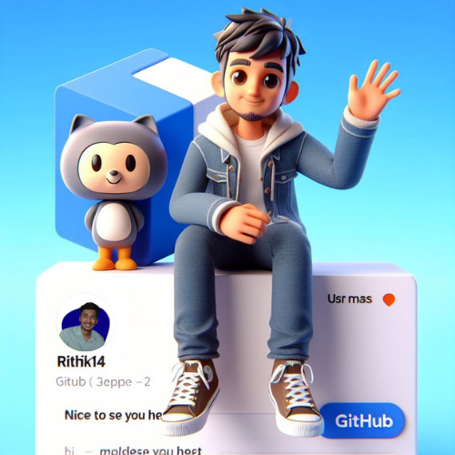

<h1 align="center">Hi 👋, I'm Rithik! Great to see you here!
</a></h1>
<h3 align="center">Currently, I am a student pursuing my bachelor's degree in Information Science Engineering.</h3>

## 😁About Me

- 💻 At the moment, I am aiming to upgrade my technical skills and develop web development projects.

- 🌱 I’m currently learning **Javascript**

- 👯 I am always open to collaborate on projects and innovative/disruptive ideas. 

- 📫 How to reach me **rithikkumble@gmail.com**

## 🚀 Languages and Tools:

 
     
    
     
    
     
     
     
     
     
     
     
    

 

    

## 📊 My Github Stats

   
    
  
   
  <b>Note:</b> Top languages is only a metric of the languages my public code consists of and doesn't reflect experience or skill level.

 
 

## Connect with me:

## ❤ Views and Followers

